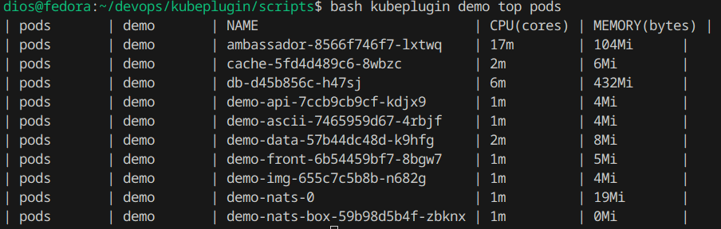

# kubeplugin
Command has next view with arguments
bash kubeplugin [namespace] [command] [resource type]

#### Example of use
```
bash kubeplugin demo top pods
```

#### Output
| pods       | demo       | NAME                           | CPU(cores) | MEMORY(bytes) |
| pods       | demo       | ambassador-8566f746f7-lxtwq    | 17m        | 104Mi      |
| pods       | demo       | cache-5fd4d489c6-8wbzc         | 2m         | 6Mi        |
| pods       | demo       | db-d45b856c-h47sj              | 6m         | 432Mi      |
| pods       | demo       | demo-api-7ccb9cb9cf-kdjx9      | 1m         | 4Mi        |
| pods       | demo       | demo-ascii-7465959d67-4rbjf    | 1m         | 4Mi        |
| pods       | demo       | demo-data-57b44dc48d-k9hfg     | 2m         | 8Mi        |
| pods       | demo       | demo-front-6b54459bf7-8bgw7    | 1m         | 5Mi        |
| pods       | demo       | demo-img-655c7c5b8b-n682g      | 1m         | 4Mi        |
| pods       | demo       | demo-nats-0                    | 1m         | 19Mi       |
| pods       | demo       | demo-nats-box-59b98d5b4f-zbknx | 1m         | 0Mi        |


#### Screep output
